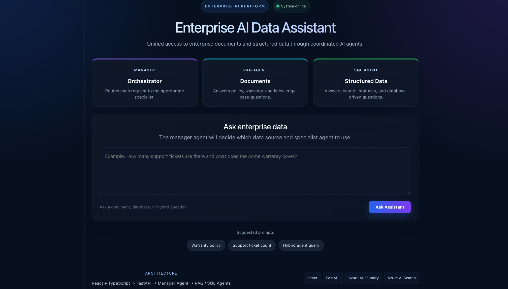

# Enterprise AI Data Assistant

A production-style multi-agent AI assistant that answers questions across both unstructured enterprise documents and structured business data.

The application uses a React + TypeScript frontend, FastAPI backend, Azure AI Foundry agents, Azure AI Search for document retrieval, and Neon PostgreSQL for structured data queries.

It is deployed end-to-end with:

- Frontend on Azure Static Web Apps
- Backend on Azure Container Apps
- Azure Managed Identity for secure authentication
- Neon PostgreSQL for cloud-hosted relational data

---

## Overview

Enterprise AI Data Assistant is designed to simulate a real-world enterprise AI platform where users can ask natural-language questions and receive answers from the appropriate data source.

A manager agent determines whether a question should be handled by:

- a RAG agent for enterprise documents
- a SQL agent for structured database questions
- both agents for hybrid questions

## Demo



Example questions:

```text
What is the warranty period for the Pro Gateway?

How many support tickets are currently open?

How many support tickets are open, and what does the warranty policy say for Product A?


## Architecture

                        ┌──────────────────────────────┐
                        │        User / Browser        │
                        └──────────────┬───────────────┘
                                       │
                                       ▼
                        ┌──────────────────────────────┐
                        │   React + TypeScript UI      │
                        │  Azure Static Web Apps       │
                        └──────────────┬───────────────┘
                                       │
                                  HTTPS / REST
                                       │
                                       ▼
                        ┌──────────────────────────────┐
                        │        FastAPI Backend       │
                        │   Azure Container Apps       │
                        └──────────────┬───────────────┘
                                       │
                                       ▼
                        ┌──────────────────────────────┐
                        │       Manager Agent          │
                        │     Azure AI Foundry         │
                        └──────────────┬───────────────┘
                                      / \
                                     /   \
                                    ▼     ▼
                    ┌──────────────────┐  ┌──────────────────┐
                    │    RAG Agent     │  │    SQL Agent     │
                    └────────┬─────────┘  └────────┬─────────┘
                             │                     │
                             ▼                     ▼
                 ┌────────────────────┐   ┌────────────────────┐
                 │ Azure AI Search    │   │ Neon PostgreSQL    │
                 │ Enterprise Docs    │   │ Structured Data    │
                 └────────────────────┘   └────────────────────┘